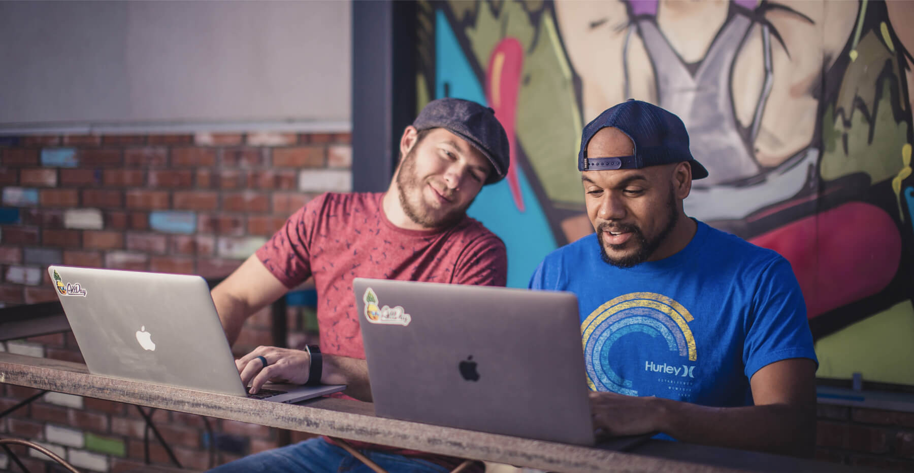

Here at AllDay we work remotely. So when I say “here”, I could really mean anywhere. AllDay was founded to be a company that aimed toward doing things a little bit differently, and simpler than the typical web agency. From day one, we broke out of the gates with two mottos to never forget as we ride down the sometimes bumpy road of starting a business. Those two mottos are “do work that gets you stoked” and “question everything…. Don't just do things a certain way because that’s how everyone else does it”. With that said, we work remotely, because we love it, and the world runs on the internet.

### How do we communicate?

Communication is one of, if not the most important aspects to running a business, and possibly life, but I’ll save the deep conversation for another day. So how do we communicate effectively? Well, truth be told, it’s not that hard. It's actually probably easier than working in an office full of employees. The keyword here is ‘effectively’. I’ve worked in not one, but many offices in my career before AllDay. And there’s a ton of inefficient communication that takes place. Hours of my week were just gone to chatter around “the water cooler”, or team meetings where ⅓ of the people there actually talked.

> The keyword here is ‘effectively’.

At AllDay we pride ourselves on using great tools to keep communication easy, fun, and effective. Most of our communication is done via Slack. Slack. Is. Amazing. They soon will add the capability to do video calls, which is great because we video chat a few times a week right now to cover larger topics that are (yep, you guessed it) inefficient to web chat about.

There’s a whole slew of project management tools that we’ve looked into. Asana, Basecamp, Jira, the list goes on and on and on. Right now we are pretty happy with Trello. It’s a simple ‘board’ based app that you can place cards on. The great thing about this is that you can kinda make your board as simple or complicated as you want. We like that flexibility, because we like simple. That is basically our 3rd motto. Oh, and within each card you can add things like to-do lists, comments, color coding, you know all the things you’d expect. But it just feels clean and simple with Trello. The last thing we want is for the tool that tells us what to do, to be a pain to use.

  

### So, do we have an office?

Nah! That’s just another overhead cost that we would need to build into the price of our projects. Right now we are happy working from your home offices, coffee shops, co-working spaces, cafes, breweries, really anywhere with a decent internet connection. No lie, I worked on Marc Edwards Photograph’s website in the passenger seat of a car on my way to Auburn Alabama. One day we think it might be cool to have an office, but mainly just to have somewhere to put the ping pong table, Classic!

### What about our employees?

Well, we don't have any full time employees yet (it’s simpler that way). But we do have an always growing number of developers and designers in our network that live all over the globe. They are all english speaking, because I haven't marked ‘learn a second language’ off of my bucket list yet. But we get stoked to work with the most talented and coolest individuals around.

### Are there drawbacks?

Sure, there are drawbacks, but just like with anything, it’s a compromise. There are way more positives by working remotely. I get to live my life by my rules. I volunteer at the local animal shelter once a week exercising and socializing dogs. Does this mean I have to get my work done at night those days? Yup! But it’s totally worth it knowing I wouldn’t have that same opportunity commuting to an office everyday. Did I mention I also foster kittens and have three animals of my own that love having me home (or nearby) during the day?

### That’s a wrap

So, that's just a small glimpse into the the life of AllDay and why we love working remotely. We will totes have to make a real video of “A Day in the Life”. If you want your project to be the next project we get stoked about, drop us a line, and we’ll get that puppy rollin!
